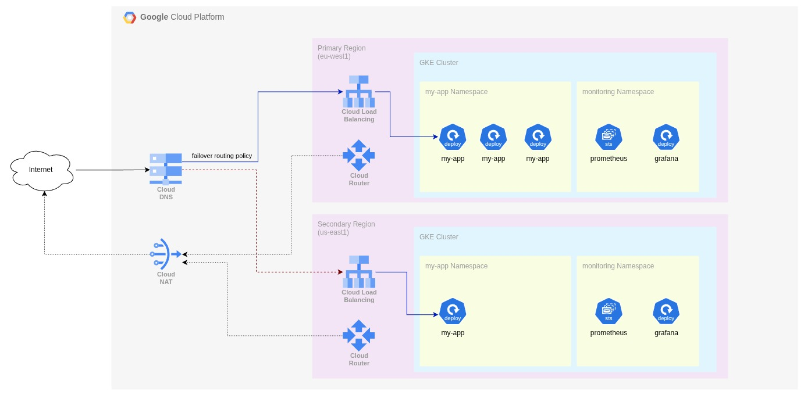
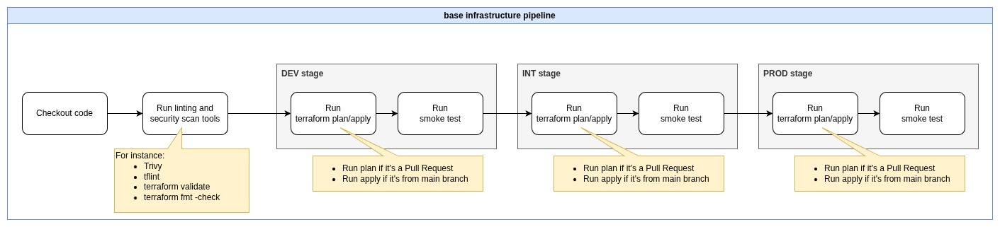
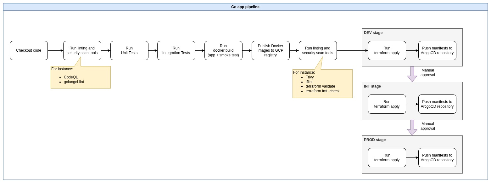

# Go app infra challenge

## 1. Infrastructure

### Architecture



In order to implement the multi-region failover architecture, I have chosen to use an Active-Passive approach using a **DNS Failover Routing Policy** to balance traffic between a primary GKE in one region and a secondary GKE in another region.

Due to the lack of context of what is the amount of traffic and from where in the globe it will come, I have decided to follow this approach because for an MVP is a cheaper approach rather than using an Active-Active approach (e.g. by using Multi-cluster Gateways with Global External HTTPS Load Balancers).

With the selected approach (DNS Failover Routing Policy) it is expected a period of some minutes of downtime, where the DNS failover records need to be propagated to the clients and where the client's DNS cache needs to expire. This issue has been partially mitigated by setting a low TTL to the DNS records.

Using a Fleet of clusters with Multi-cluster Gateways could be interesting to implement in the future if we need to provide service to customers across the globe, what could justify the costs of having multiple clusters running multiple instances of our workloads and using Global Load Balancers (more expensive). It could also solve the downtime issue mentioned related to the DNS resolution cache and propagation.

In future iterations, we could also add a CDN in front of our Load Balancers in order to cache some of the application contents and with this reduce latency and traffic costs.

### Networking

In order to have more control on ohw many IP are available to GKE nodes, Pods and services, I manually have configured the different subnet secondary ranges accordingly.

The subnet masks have been chosen to allocate up to 256 nodes (/24) and the maximum Pods capacity allowed by Pod (256 Pods per node, so /16). For GKE Services a /20 mask have been chosen because we'll need more services than nodes, but less than number of Pods.

### Monitoring

Right now the monitoring stack (Prometheus and Grafana) is deployed in the same cluster as the workloads since this is an MVP. In the future we should move the monitoring stack out of the subject under test (i.e. the cluster) to ensure that the monitoring stack keeps working even if the whole cluster is down.

Cluster and app logs should be available in Google Cloud Logging service. In future iterations, we could evaluate if Google Cloud Logging service meets our needs or we should implement a 3rd party logging solution.

### Security

Applying the Least Privilege principle, we have created a new service account to be used by the GKE nodes in order to push metrics and logs into GCP monitoring services and to pull Docker images from the GCP Artifacts registry.

A Firewall rule has been created to allow GCP services to run health checks against GKE nodes.

In order to securely access the GKE cluster I have prevented public access to GKE API endpoint by enabling private endpoints only. This will force that our CI/CD solution must have a Runner instance deployed in the same VPC in order to apply changes into the cluster.

Additionally, GKE nodes will only have private IP addresses, what ensures that cluster applications should only be reachable from the same VPC or publicly exposed via a Load Balancer.

### Additional notes

- In order to run the Terraform code it is required to have a bucket created with the name `terraform-states`.
- I have divided the Terraform code in 2 different stacks (`base` and `app`) In order to keep domains separated and prevent coupling different scopes:
  - `base` is the underground infrastructure required to host our Go application. This infrastructure would probably be managed by the Operations team or expert and contains resources that could be shared with other application stacks in the future.
  - `app` is the stack responsible to deploy only the resources related to the Go application. This stack could be managed by the development team without having to worry about the configuration of the underlying infrastructure.
- I kept Helm deployments in different resources blocks (instead of using `for_each` for sake of simplicity), because that way we have more flexibility to customize each deployment configuration separately.
- I have added the `Gateway` resource as part of the app chart in order to simplify and provide flexibility to the configuration of the `hostname`.

### Incomplete tasks

Due to the lack of time to further implement this solution, there have been some implementation details or improvements I couldn't implement:

- I just realized that with the current implementation, some things are missing to properly expose the application to Internet:
  - A proxy-only subnet on each Region for each Load Balancer.
- Expose the application through HTTPS using a self-signed certificate: in order to expose the application securely to the Internet we could deploy `cert-manager` in the GKE clusters in order to leverage the domain configuration from the `Gateway` resources to issue a certificate from Let's Encrypt.
- In order to allow administrator/operations tasks in the GKE cluster, a jumpbox/bastion machine accesible only from a VPN should be created in a separate subnet in the same VPC in order to run Kubernetes commands against the GKE private endpoints.
- **Custom metrics for HPA:** In the current MVP implementation, only CPU metric have been used to scale Pods. In a future iteration, we could configure Prometheus Exporters to properly retrieve custom metrics (e.g. the amount of busy go routines) and configure the Horizontal Pod Autoscaler to scale base on that metric.
- More Firewall rules could be configured in order to enforce that only the expected traffic is allowed to access the different components within the VPC.
- ArgoCD and ArgoRollouts could be configured and deployed on each cluster in order to manage it's own resources deployments using a GitOps approach and to allow canary deployments. This way we make sure the GKE private endpoints are reachable (we would need to make sure there are proper Firewall rules that allow ArgoCD to pull contents from the Git repositories).
  - Additional node pools could be configured into the GKE clusters in order to allow allocating more resources for Runners to run.
  - Helm charts should be also updated to start using `Rollout` resources instead of `Deployments` to enable features like Canary deployments.

## 2. Application

In the current approach, a Terraform stack has been created in order to deploy all the application specific resources in GCP, including the application Helm chart. While this approach it's simple and allows to start deploying the application with just a simple CI/CD tool that could run Terraform commands, it would require some refactoring and bespoke scripts and complex logic in order to provide more complex features like Canary Deployments or prevent change drifts.

In order to support more complex deployment patterns (like Canary or Blue/Green deployments), we could choose GitHub Actions as our CI tool to build and publish our Go Server Docker images (because it's easy to implement and start using it) and ArgoCD + ArgoRollouts for our CD tool (because they allow to implement a GitOps approach, which would prevent drift changes, and because these tools come with plenty of features like Canary deployments out-of-the-box).

For security reasons and to simplify the credentials configuration required for the deployment of resources, we could deploy GitHub Runners and ArgoCD in a "cicd" GKE cluster (to make it easier to scale and parallelize jobs and to prevent any disruption to the application clusters).

**Suggested pipeline to deploy the base infrastructure**



**Suggested pipeline to deploy the application**



### Continuous Integration

In order to make sure our Go application is secure or follow the best practices, we will need to run linting tools like CodeQL (provided by GitHub). Also before building the Docker image we should run some unit tests or even integration tests to make sure all work as expected. We could also use tools like Trivy to list the Dockerfiles.

To deploy the infrastructure, linting and security scan tools will be also required to ensure the configuration pushed follow the best practices. We could also include some Compliance tests using tools like `terraform-compliance` to check our code against custom policies to ensure it follows the company's regulations.

### Continuous Deployment

ArgoCD will be the responsible to make sure our environments match the desired state by redeploying the resources if an unexpected change is detected. We will need a separated repository where our CI pipelines will push all the deployment manifests for our applications.

In order to start using ArgoRollouts we may need to replace our `Deployment` resources from the Helm charts with `Rollout` (although if we want to distribute our Helm charts for other teams to deploy them without ArgoRollouts, we could keep both approaches and select what templates should be used using a flag in the values.yaml file).

Since we are dividing the deployment of the application code (Helm + ArcgoCD) from its infrastructure (Terraform), we will need to refactor the Terraform code in order to expose some information that will be required to properly configure the Helm values.yaml file, using Terraform outputs.

In order to define a proper Automatic Rollback Strategy we should configure our `Rollout` with `AnalysisTemplate` (or `ClusterAnalysisTemplate`) to check the "canary" instances and proceed with the deployment only if everything is OK, or abort the deployment if something is wrong. We could configure the `AnalysisTemplate` to deploy a `Job` that will run some smoke test we could have baked in a Docker image as part of the application's CI pipeline.

If for any reason we need to rollback to a previous version of our deployment we could simply leverage that we are using a GitOps approach and manually revert to a previous commit simply using Git commands.

In order to propagate the application across environments I decided to add manual approvals because I may need more information about how is the development and testing lifecycle of this application in order to properly replace this manual gates with automated ones (e.g. based on the result of some battery of tests).

## 3. Security

Some of the best practices to take into consideration when implementing this kind of stack have been already explained before:

- Apply Least Privilege principle: by default, GKe nodes have too much permissions to operate other GCP services. We need to create a new Service Account containing only the required permissions (in this case we identified the permissions to write metrics and logs into the GCP monitoring services and to pull Docker images from the Artifacts Registry).
- Expose HTTPS traffic only: with this we make sure all traffic is encrypted on transit.
- Private GKE node: with this option enabled we make sure the GKE nodes can only receive traffic from our VPC. This feature along with the proper Firewall rules, can enforce that only traffic coming from the Application Load Balancers can reach our our cluster applications.
- Enable only private GKE endpoints: with this we make sure that the Kubernetes clusters can only be accessed from a private IP, so we prevent to expose any sensitive endpoint.
  - In order to access this GKE endpoints a jumpbox/bastion machine accesible only from a VPN (enforced by Firewall rules) should be created in a separate subnet in the same VPC.
- In the scenario where a Vault may be required (e.g. to store some DB credentials our app should access), I would suggest to use the native GCP Secret Manager and would enable the CSI driver in the GKE cluster config in order to have direct integration using the `Secret` resources.
- Some of the Firewall rules that should be present:
  - Ingress Rule to allow GCP services to properly operate our GKE clusters (e.g. the rule included int the Terraform code for health checks).
  - Ingress Rule to allow traffic from the Application Load Balancers to GKE subnets.
- Along with the Firewall rules, we should also implement `NetworkSecurityPolicies` to also secure the traffic within the cluster.
  - We should have a default policy to deny all traffic, but making sure that main cluster functionalities (like internal DNS or the monitoring stack) keep working. An example:
  
  ```yaml
  kind: NetworkPolicy
  apiVersion: networking.k8s.io/v1
  metadata:
    name: default-deny
  spec:
    policyTypes:
    - Ingress
    - Egress
    podSelector: {}
    ingress:
      - from:
        - namespaceSelector:
            matchLabels:
              name: monitoring
    egress:
      - to:
        - namespaceSelector:
            matchLabels:
              kubernetes.io/metadata.name: kube-system
          podSelector:
            matchLabels:
              k8s-app: kube-dns
        ports:
        - protocol: TCP
          port: 53
        - protocol: UDP
          port: 53
  ```

  - Then should also provide a `NetworkSecurityPolicies` for each of the different application we have deployed in the cluster in order to allow the required Ingress/Egress traffic (e.g. allow ingress traffic only to the exposed port of the Go app Pod).
- `PodSecurityPolicies` resources have been deprecated in Kubernetes. Those were used to enforce what kind of Pod definitions should the cluster API allow to create. For instance, you could use them to prevent any Pod with privilege permission (run as root) to be deployed.
  - Nowadays Kubernetes allows to apply some predefined policies by adding labels to specific `Namespaces`. For instance, we could use the label `pod-security.kubernetes.io/enforce: restricted` which is the most restrictive policy available, which forbids any Pod to run as root or to use any Linux Capability (for instance the Go app doesn't need any to operate).
  - In most cases, a 3rd party solution like Kyverno is implemented to reate more tailored policies, with custom rules to meet different scenarios.
  - In our current implementation I would suggest to forbid any Pod in `my-app` Namespace to be deployed if:
    - Tries to run as root or allows privilege escalation.
    - Doesn't have `requirements` defined.
    - Tries to mount a volume (our current definition doesn't need them).
    - Drop all Linux capabilities.
    - Enforce the images are from a trusted registry or even limit that the only image to be used is the one we created for the Go application.
- Some of the previous implementations are required for a Zero Trust architecture, but in order to add additional layers of protection, we could implement a Service Mesh in order to make sure that all GKE internal traffic is also encrypted (with the suggested approach with `cert-manager` TLS termination happens in the Load Balancer), and to validate each Pod identity with mTLS (making sure that only trusted authenticated users can consume our services).
- In order to configure a WAF with Cloud Armor, we should:
  1. Create a new security policy with Terraform enabling most of the preconfigured WAF rules from GCP to prevent most common attacks like SQL Injection (`sqli-v33-stable`) or Cross-site Scripting (`xss-v3-stable`).
  2. Create a `GCPBackendPolicy` in the GKE clusters to start using this security policy and to attach it to the Go app service. We should modify the Helm chart to include a proper template for this resource, but it should look like:

  ```yaml
  apiVersion: networking.gke.io/v1
  kind: GCPBackendPolicy
  metadata:
    name: my-app-policy
    namespace: my-app
  spec:
    default:
      securityPolicy: my-app-security-policy # The name of the policy we created with Terraform
    targetRef:
      group: ""
      kind: Service
      name: my-app
  ```

- In order to enable audit logs we could add a `logging_config` section in our cluster Terraform code with the proper configuration to enable audit logs for the `APISERVER` components (auditing with that all calls to the GKE API).
